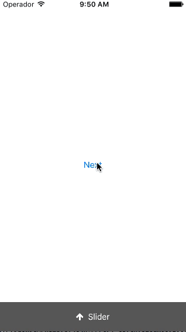

# FVVerticalSlideView
This library for iOs provides an easy and simple vertical slider where you can add your custom subviews. It have some protocols for improve the UX.

#### Version 0.1

## Easy to use:

    //In your ViewController:
    
    - (void)viewDidLoad {
        [super viewDidLoad];
        CGFloat top = 20;
        CGFloat bottom = 50;
        slider = [[FVVerticalSlideView alloc] initWithTop:top
                                                   bottom:bottom
                                          translationView:self.view];
        [slider setBackgroundColor:[UIColor darkGrayColor]];
        slider.delegate = self;
        [self.view addSubview:slider];

		//	Enable 2 phases animation: move slider to animationLengthPhase2 in animationDurationPhase1, then finish the rest animation in animationDurationPhase2
		slider.animationDurationPhase1 = 0.1;
		slider.animationDurationPhase2 = 0.5;
		slider.animationLengthPhase2 = 160;
    }
    
Example: <a href="https://github.com/tato469/FVVerticalSlideView/tree/master/FVVerticalSlideViewExample">Take a look!</a>

## Installation:
#### Manual:
Copy the files inside of resources folder in your project: 

    FVVerticalSlideView.h 
    FVVerticalSlideView.m

#### CocoaPods:
    pod 'FVVerticalSlideView'

## Author

Fernando Valle, fernandovalle.developer@gmail.com

## License

FVVerticalSlideView is available under the MIT license. [See the LICENSE file for more info](LICENSE).

