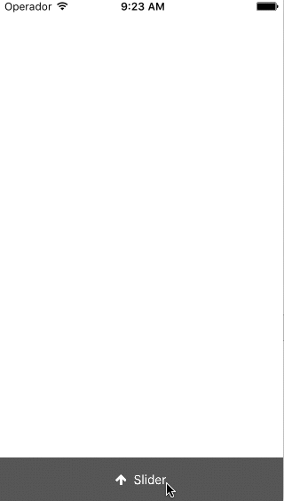

# FVVerticalSlideView
Easy and simple vertical slider where you can add your custom subviews. It have some protocols for improve the UX.

example of use:

    CGFloat top = 20;
    CGFloat bottom = 50;
    
    slider = [[FVVerticalSlideView alloc] initWithTop:top
                                               bottom:bottom
                                      translationView:self.view];
    
    [slider setBackgroundColor:[UIColor darkGrayColor]];
    [slider setTopY:top];

